# Cancel Batch App

```
 - Crontab
 30 0 * * * (매일 0시 30분)
```

## 1. Cancel Batch App

## 개요

- 해지자 배치 프로그램

<br>

## (1) 주요 동작 
<br>

### 1-1. GetMemberCount
```
 CbaMember에서 프로세스가 완료되지 않은 data를 Count한다.
```
### 1-2. GetSearchMember
```
 CbaMember에서 프로세스가 완료되지 않은 data를 Select한다.
```
### 1-3. UpdateStatus
```
 CbaMember 해당 data의 Complete, CompleteDT를 Update한다. 
 (default = -1, Process Start = 1, Process End = 2)
```
### 1-4. Member_delete
```
 PSMemberDelete Procedure를 Call한다.
```
### 1-5. GetDelMember
```
 SvcMemberHistory에서 해당 PNumber의 최신 data 1개를 Select한다.
```
### 1-6. TransMsg_Insert
```
 SvcTransMsg에 새로운 data를 Insert한다.
```
### 1-7. CheckCancelCode
```
 SvcCbaCode에서 해당 통신사의 CbaCode와 일치하는 data를 Count한다.
```
### 1-8. InsertCancelCode
```
 SvcCbaCode에 새로운 data를 Insert한다.
```

## (2) Procedures / Triggers / Events

<br>

### 2-1. PSCbaBatch
```
 CallPSCbaBatch Event로 실행되는 procedure로 기존의 CbaMember의 data를 삭제하고 SvcMember에서 새로운 Telecom, PNumber, PushToken, CompleteDT의 data를 Insert한다. (default Complete = -1)
```

### 2-2. CallPSCbaBatch
```
 PSCbaBatch를 실행시키는 Event로 매일 23:59:59에 실행된다.
```

### 2-3. PSMemberDelete
```
 Member_delete query로 Call되는 Procedure로 SvcMember 해당 PNumber data의 ReqAppUnreg, UnRegType, UnRegMsg를 Update한 뒤, Delete한다.
```

### 2-4. TRMemberDelte_Before
```
 SvcMember data를 Delete하기 전에 실행되는 trigger로 해당 data를 SvcMemberHistory에 Insert한다.
 또한, SvcMember data와 연관된 다른 table의 data들도 Delete한다.
```

<br>

## (3) Sequence diagram

```mermaid
sequenceDiagram
    participant process
    participant common.callDMRS
    participant common.callTCRS
    participant common.utils
    participant TCRS
    participant DMRS

    process->>+common.callDMRS: callDMRS.SQ(GetMemberCount, parameters...)
    common.callDMRS->>+DMRS: _this.RequestSQ(GetMemberCount, parameters...)
    Note right of DMRS: SELECT COUNT(*) AS CountMember <br/> FROM CbaMember <br/> WHERE complete IN (-1, 1)
    DMRS-->>-common.callDMRS: return(json)
    common.callDMRS->>+common.utils: utils.JsonToHaderBody(json)
    common.utils-->>-common.callDMRS: return(RspHeader)
    common.callDMRS-->>-process: return(memberCount)

    process->>+common.callDMRS: callDMRS.SQ(GetSearchMember, parameters...)
    common.callDMRS->>+DMRS: _this.RequestSQ(GetSearchMember, parameters...)
    Note right of DMRS: SELECT * FROM CbaMember <br/> WHERE complete IN (-1, 1) <br/> AND MOD(PNumber,2)=? LIMIT ?
    DMRS-->>-common.callDMRS: return(json)
    common.callDMRS->>+common.utils: utils.JsonToHaderBody(json)
    common.utils-->>-common.callDMRS: return(RspHeader)
    common.callDMRS-->>-process: return(searchList)

    loop searchList
    alt searchList exists
    process->>+common.callDMRS: callDMRS.CQ(UpdateStatus, parameters...)
    common.callDMRS->>+DMRS: _this.RequestCQ(UpdateStatus, parameters...)
    Note right of DMRS: UPDATE CbaMember <br/> SET Complete=1, CompleteDT=Now() <br/> WHERE PNumber=?
    DMRS-->>-common.callDMRS: return(json)
    common.callDMRS->>+common.utils: utils.JsonToHaderBody(json)
    common.utils-->>-common.callDMRS: return(RspHeader)
    common.callDMRS-->>-process: responseOK

    process->>+common.callTCRS: callTCRS.CQ(parameters...)
    common.callTCRS->>+TCRS: _this.RequestCQ(parameters...)
    TCRS-->>-common.callTCRS: return(json)
    common.callTCRS->>+common.utils: utils.JsonToHaderBody(json)
    common.utils-->>-common.callTCRS: return(RspHeader)
    common.callTCRS-->>-process: return(tcrsRSP)

    opt ReturnCode / JOIN_YN
    process->>+common.callDMRS: callDMRS.CQ(Member_delete, parameters...)
    common.callDMRS->>+DMRS: _this.RequestCQ(Member_delete, parameters...)
    Note right of DMRS: CALL PSMemberDelete('CBA',?,'해지',?) <br/> // ReqAppUnreg, UnRegType, UnRegMsg, PNumber
    DMRS-->>-common.callDMRS: return(json)
    common.callDMRS->>+common.utils: utils.JsonToHaderBody(json)
    common.utils-->>-common.callDMRS: return(RspHeader)
    common.callDMRS-->>-process: responseOK

    process->>+common.callDMRS: callDMRS.SQ(GetDelMember, parameters...)
    common.callDMRS->>+DMRS: _this.RequestSQ(GetDelMember, parameters...)
    Note right of DMRS: SELECT * FROM SvcMemberHistory <br/> WHERE PNumber = ? AND Telecom = ? <br/> ORDER BY UnRegDT DESC LIMIT 1
    DMRS-->>-common.callDMRS: return(json)
    common.callDMRS->>+common.utils: utils.JsonToHaderBody(json)
    common.utils-->>-common.callDMRS: return(RspHeader)
    common.callDMRS-->>-process: return(member)

    alt PushToken exists
    process->>+common.callDMRS: callDMRS.CQ(TransMsg_Insert, parameters...)
    common.callDMRS->>+DMRS: _this.RequestCQ(TransMsg_Insert, parameters...)
    Note right of DMRS: INSERT INTO SvcTransMsg (MsgType, PCode, Telecom, <br/> PNumber, PushToken,  PushData, Title, Msg, Complete) <br/> VALUES (?, 'Datauniverse', ?, ?, ?, ?, ?, ?, ?)
    DMRS-->>-common.callDMRS: return(json)
    common.callDMRS->>+common.utils: utils.JsonToHaderBody(json)
    common.utils-->>-common.callDMRS: return(RspHeader)
    common.callDMRS-->>-process: responseOK
    end

    alt ReturnDesc Contains "|"
    process->>+common.callDMRS: callDMRS.SQ(CheckCancelCode, parameters...)
    common.callDMRS->>+DMRS: _this.RequestSQ(CheckCancelCode, parameters...)
    Note right of DMRS: SELECT COUNT(*) AS CountCbaCode FROM SvcCbaCode <br/> WHERE Telecom = ? AND CbaCode = ?
    DMRS-->>-common.callDMRS: return(json)
    common.callDMRS->>+common.utils: utils.JsonToHaderBody(json)
    common.utils-->>-common.callDMRS: return(RspHeader)
    common.callDMRS-->>-process: return(CbaCodeCount)

    alt CbaCodeCount = 0
    process->>+common.callDMRS: callDMRS.SQ(InsertCancelCode, parameters...)
    common.callDMRS->>+DMRS: _this.RequestSQ(InsertCancelCode, parameters...)
    Note right of DMRS: INSERT INTO <br/> SvcCbaCode (CbaCode, Telecom, Msg, AppName) <br/> VALUES ( ? , ? , ? , ? )
    DMRS-->>-common.callDMRS: return(json)
    common.callDMRS->>+common.utils: utils.JsonToHaderBody(json)
    common.utils-->>-common.callDMRS: return(RspHeader)
    common.callDMRS-->>-process: return(CbaCodeCount)
    end
    end
    end
    end
    process->>+common.callDMRS: callDMRS.CQ(UpdateStatus, parameters...)
    common.callDMRS->>+DMRS: _this.RequestCQ(UpdateStatus, parameters...)
    Note right of DMRS: UPDATE CbaMember <br/> SET Complete=2, CompleteDT=Now() <br/> WHERE PNumber=?
    DMRS-->>-common.callDMRS: return(json)
    common.callDMRS->>+common.utils: utils.JsonToHaderBody(json)
    common.utils-->>-common.callDMRS: return(RspHeader)
    common.callDMRS-->>-process: responseOK
    end
```

<br>


